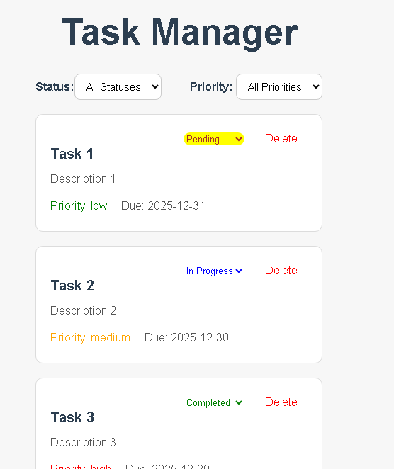

# Lab 3-task-manager

# Project Overview

    This is a Task Manager app built using React and TypeScript. It allows users to manage a list of tasks with status (pending, in-progress, completed), priority (low, medium, high), and due dates. Users can filter tasks, update their status, and delete tasks dynamically.

# Features

    Filter tasks by status and priority.
    Delete Task
    Conditional styling of tasks based on status and priority.
    Responsive UI with dynamic rendering of filtered tasks.

# How it Works

    Task Display: All tasks are stored in the tasks state.
    Filtering: User selects filters in TaskFilter, which updates the statusFilter and priorityFilter states.
    Dynamic Rendering: filteredTasks is computed dynamically based on the filters, and only matching tasks are rendered using <TaskItem>.
    Status Updates: Users can change a task’s status via a dropdown in <TaskItem>, triggering a state update in App.
    Deletion: Clicking “Delete” removes a task from the tasks state and updates the UI.

# Components

    App.tsx → State Management
    Holds the main tasks state and filter states (statusFilter, priorityFilter). Computes filteredTasks and passes data/handlers to child components.

    TaskFilter.tsx → Filter UI
    Provides dropdowns for selecting status and priority filters. Sends the selected filter values to App via onFilterChange.

    TaskItem.tsx → Task Display and Action
    Displays a single task with title, description, status, priority, and due date. Allows updating status and deleting the task. Applies conditional styling based on status/priority.

    TaskList.tsx → Task Container
    Maps over tasks (or filteredTasks) and renders a <TaskItem> for each, ensuring unique keys for efficient rendering.

# Workflow

    User selects a filter in TaskFilter →
    onFilterChange sends the selected value to App →
    App updates statusFilter/priorityFilter state →
    App recalculates filteredTasks based on the current filters →
    filteredTasks is passed down to TaskList →
    TaskList maps through filteredTasks and renders TaskItem →
    TaskItem displays the task with correct status, priority, and styling.

# Reflection

1. How did you ensure unique keys for your list items?

   Each task has a unique id.
   When rendering tasks with .map(), we pass task.id as the key to <TaskItem> to help React efficiently track changes and avoid unnecessary re-renders.

2. What considerations did you make when implementing the filtering functionality?

   Filters should not modify the original tasks state, only control what is displayed.
   “All” option must show all tasks.
   Both status and priority filters are combined using AND logic.

3. How did you handle state updates for task status changes?
   Task status is updated by creating a new array of tasks using .map().
   Only the task that matches the ID is updated; others remain unchanged.
   The updated array replaces the old tasks state, triggering a re-render.

4. What challenges did you face when implementing conditional rendering?

   Ensuring that filters correctly reset when “All” is selected.
   Conditional styling for status and priority without affecting unrelated tasks.
   Avoiding TypeScript errors while handling optional or empty filter values ("" vs undefined).

# Screen shot

